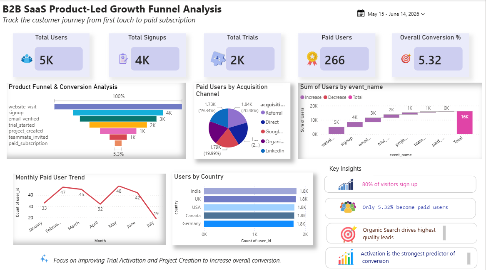

# B2B SaaS Product-Led Growth Funnel Analysis

## Overview
End-to-end SaaS Funnel Analysis project using SQL Server, Power BI, and Python.

## Tools Used
- SQL Server
- Power BI
- Python
- DAX

## Key Features
- Funnel Conversion Analysis
- Acquisition Channel Performance
- Country Analysis
- Monthly Paid User Trends
- Business Insights & Recommendations

## Dashboard Preview

## Key Metrics
- Total Users: 5,000
- Total Signups: 4,000
- Total Trials: 2,000
- Paid Users: 266
- Overall Conversion Rate: 5.32%

## Business Insights
- 80% of visitors complete signup.
- Largest drop-off occurs after Trial Started.
- Organic Search generates the highest quality leads.
- Activation strongly influences paid conversion.
